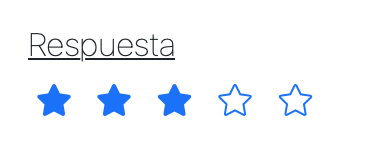
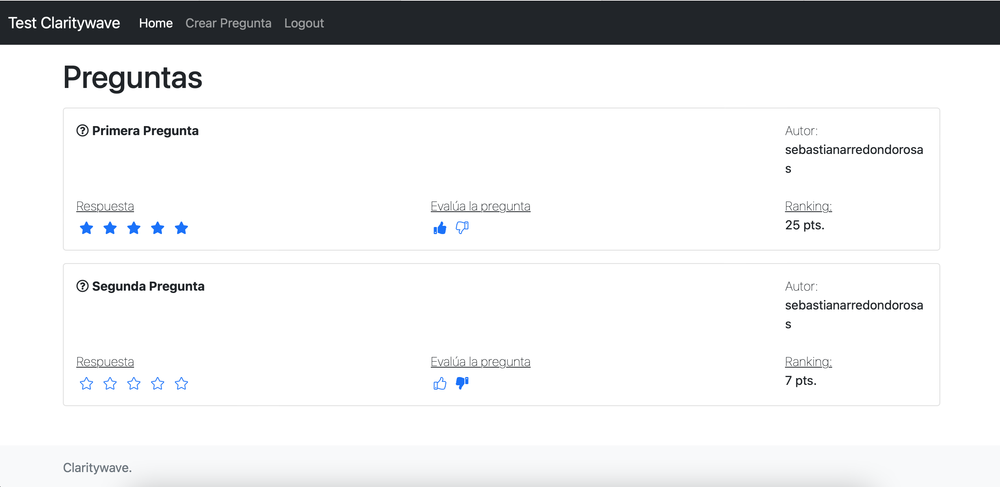
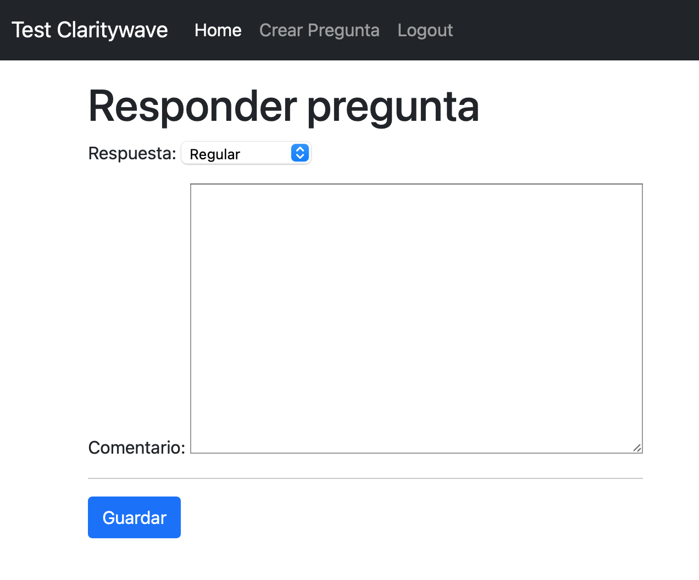

# Claritywave challenge

Author: CW-TEAM

## Instrucciones:

### How to

1. Genera un fork de este proyecto para que puedas trabajar en tu propio espacio.
2. Una vez finalizado, esperamos que nos envíes el enlace a tu repositorio y el tiempo estimado que te llevó hacerlo. Si
   no quieres hacer público tu fork, nos puedes contactar y te decimos como lo solucionamos.

### Constraints

Esperamos que dejes una app funcional.

* En la página principal se tienen que mostrar las mejores 20 preguntas ordenadas según el siguiente ranking:
    1. Cada respuesta suma 10 puntos al ranking
    2. Cada like suma 5 puntos al ranking
    3. Cada dislike resta 3 puntos al ranking
    4. Las preguntas del día de hoy, tienen un extra de 10 puntos

_Ejemplo_:
Una pregunta que tiene 6 respuesta de usuarios, 2 likes y 1 dislike:  
ranking: `6*10 + 2*5 - 1*3 = 60 + 10 - 3 = 67`  
Si además es del día de la hoy:  
ranking: `6*10 + 2*5 - 1*3 + 10 = 60 + 10 - 3 +10 = 77`

### A tener en cuenta:

- Modifica todo lo que creas necesario. Dejamos errores voluntariamente.
- Evaluaremos no solo la funcionalidad, también esperamos una buena performance ante la posibilidad de que escale el
  proyecto
- El sistema de login/logout no es necesario modificarlo. Genera los usuarios para probar desde la consola.

### Extras

- Si puedes levantar un entorno con docker, te invitamos a que lo hagas.
- Nos gustaría ver que puedes generar un test con los casos de usos básicos.

###  

### Ejemplo

Este es un ejemplo de como queda el listado con su ranking y se ve como respondió/votó el usuario actual.

## Solución

### Funcionalidades

### Home

Siguiendo las instrucciones, podemos ver o realizar lo siguiente:

* **Evaluar una pregunta:** al hacer clic en el icono de like o dislike, cambian los puntos de `ranking` de la pregunta.
  Además, muestra la evaluación realizada previamente y permite editarla haciendo clic en el icono contrario. Esta
  funcionalidad requiere que el usuario esté autenticado.
* **Respuesta:** Al hacer clic en una de las estrellas, permite responder la pregunta (ver Responder una Pregunta). Si
  ya se respondió, muestra el valor guardado. A diferencia de la imagen de ejemplo en las instrucciones, me pareció más
  intuitivo pintar todas las estrellas hasta el valor de la respuesta. Esta funcionalidad requiere que el usuario esté
  autenticado.\
  
* **Ranking:** Tal como indican las instrucciones, muestra las mejores 20 preguntas, ordenadas de mayor a menor, y su
  respectivo puntaje.

### Responder una Pregunta

Noté que el modelo `Answer` posee una columna de `comments`, por lo que decidí crear una vista nueva para responder la
pregunta, que se accede a través de los iconos de "estrella" del home. Además, según el icono seleccionado, precarga la
opción equivalente en la vista de responder pregunta. Por ejemplo, si hago clic en la tercera estrella, el formulario
preseleccionará el valor "Regular" y podré escribir un comentario.

### Modelos Nuevos

> ### Vote
>
>Almacena los likes (`True`) y dislikes (`False`) que realizan los usuarios en las preguntas. Además, añade una
> restrición de un solo registro para un mismo usuario y pregunta.

### Cálculo del Ranking

Con el objetivo de calcular el ranking de las preguntas de forma reutilizable, escribí la
clase `QuestionRankingCalculator`, que recibe en su constructor un queryset del modelo `Question`. De esta forma puede
calcular cualquier listado de preguntas, por ejemplo filtradas o no.

También pensé en una solución alternativa a este problema, la cual consiste en crear una nueva columna `ranking` en el
modelo de `Question`. Luego sobreescribir los métodos CRUD de los modelos `Answer` y `Vote` para que incrementen o
disminuyan el valor de `ranking` con cada operación. Sin embargo, decidí no utilizar esta solución porque mi principal
objetivo era evitar consultar la tabla completa de Question, y no lo conseguría a menos que aumentara la complejidad de
mantener dicha columna, por ejemplo con la regla de negocio de aumentar 10 puntos cuando la pregunta es del día actual.

### Pruebas Unitarias

Enfoqué las pruebas en la funcionalidad más compleja, que es el cálculo de los puntos de ranking de cada pregunta. Cubrí
los distintos escenarios en `survey/business_logic/tests.py`.

### Posibles mejoras a futuro

* Validar que los usuarios solo puedan responder cada pregunta una vez y modificar su respuesta en el futuro.
* Añadir un enlace en cada pregunta del home que permita editarla.